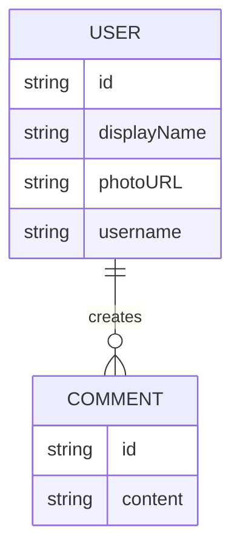

# Photos Portfolio for bichbui.com

Technologies:

- Nuxt 3
- Headless UI
- Heroicons
- Tailwindcss
- Fully customized light and dark themes
- Internationalization: German, English, Vietnamese
- Firebase Auth
- Firebase firestore
- Namecheap domain
- Vercel hosting

Features:

- User authentication
- View albums and photos

Scraped Ideas:

- Prisma
- Planetscale DB
- C2 Object Storage

## Docs

## Dev notes

- i18n is a mess with Nuxt - too much config required, does not work out of the box
- unplugin-auto-import does too much magic but still requires configurations, e.g subfolders scanning
- Really good dev tools, embded on webpage
- Volar displays type of response, pretty sick
- Integration of component-pinia-nuxt server api did not work at first (volar shows type correctly, but response is null)
  - Seems to be timing issue, page refresh = null response, but loaded the app and navigating to page = correct response
  - Node issue? https://stackoverflow.com/questions/74759799/nuxt-3-ssr-usefetch-returning-null-on-page-refresh
  - Instead of component -> action -> pinia -> nuxt server api with useFetch you need to
    component -> useAsyncData(action) -> pinia -> nuxt server api (??)
    ) - should probably read the docs before doing stuff
- Prettier 3.1.1 broke vs code plugin

## Time tracking

- 29.05.2023: 8h
- 30.05.2023: 1h
- 31.05.2023: 2h
- 18.12.2023: 4h
- 19.12.2023: 4h

---

Total: 19h
